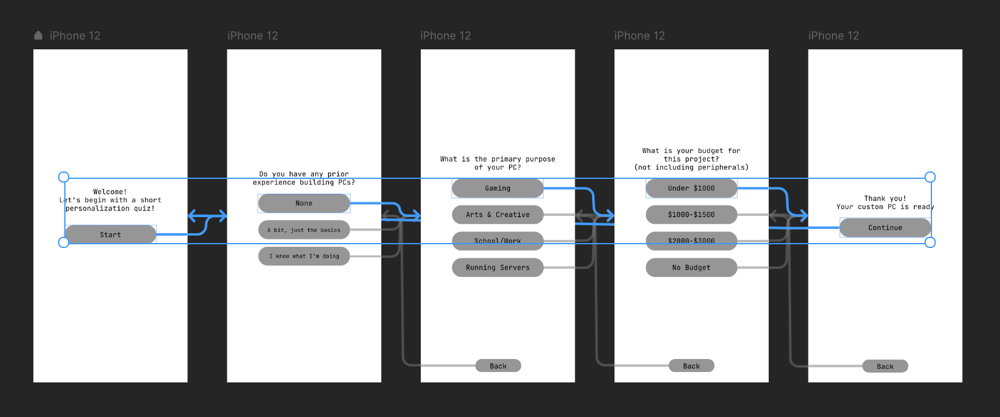
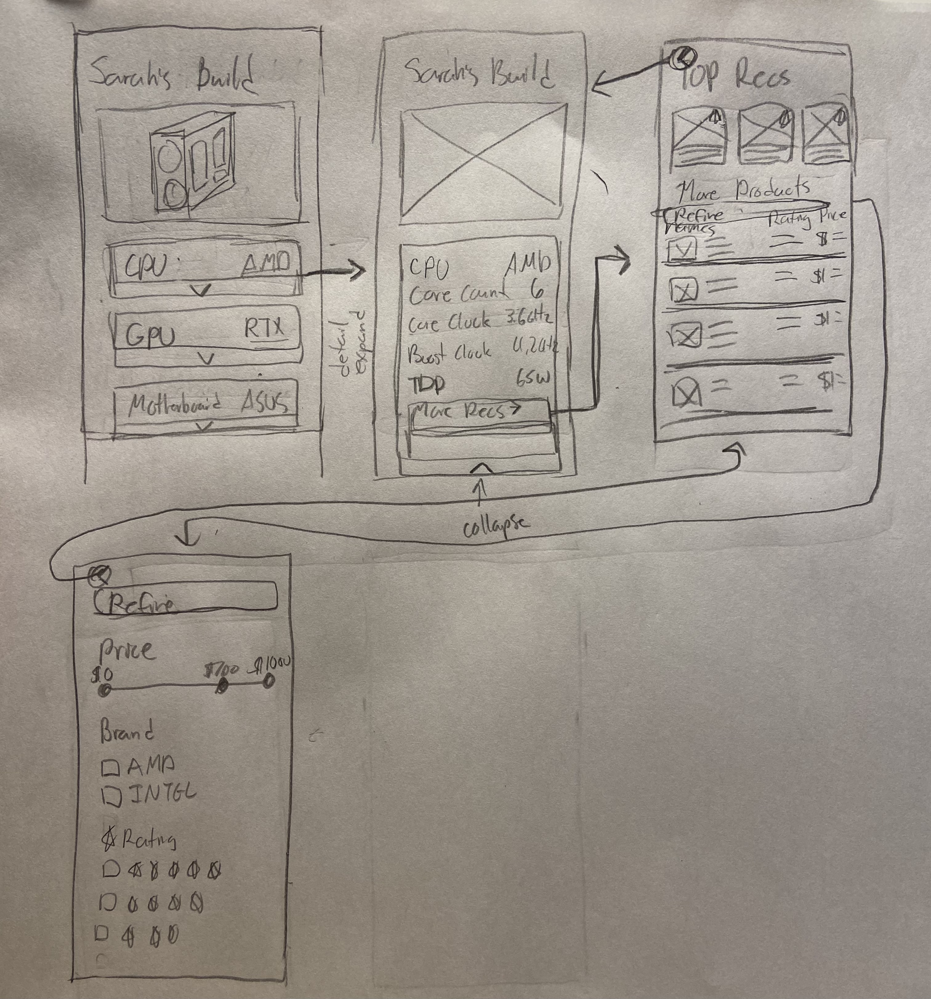
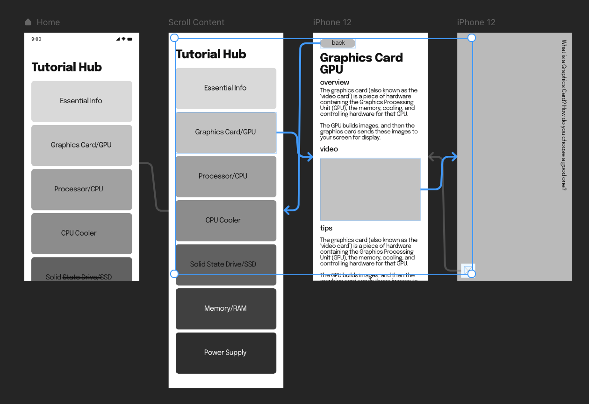
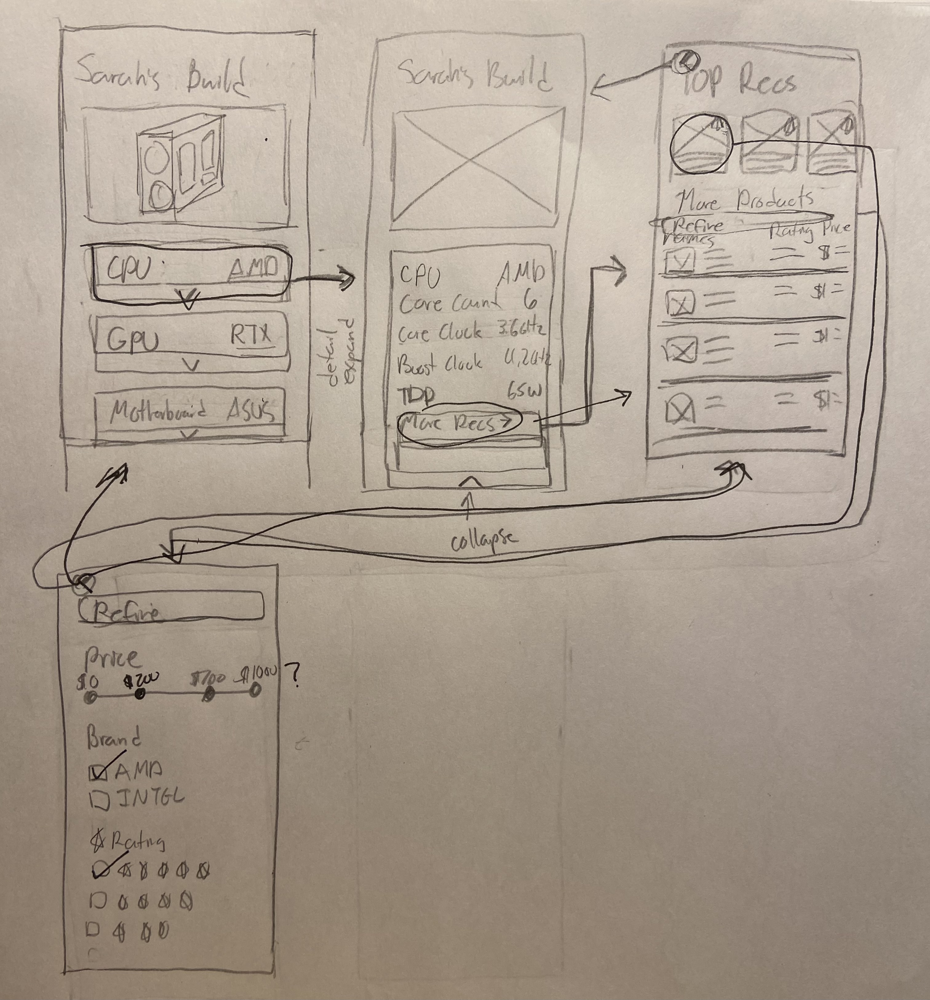

# Assignment05: Low Fidelity Prototype
### DH110, Joie Cao

## Intro

**Purpose:** The purpose my project is to develop a beginner friendly PC building app that helps users to learn, purchase, and build their first PCs. The purpose of this low-fidelity prototype is to put my initial ideas on paper and test it with a user to better understand their experience and interaction with my designs. This prototype will be an app, as I imagine users taking their PC parts list (like a shopping list) into stores to search for the right products. Additionally, while assembling, an app provides quick and easy reference. 

**User Personas:** Users of my app will be curious PC builders of all ages but mostly young adults. I expect some to be migrating from MacOS and most users to be inexperienced beginners. 

**Features & Tasks:** 

1. Experience quiz- a short, 3 question quiz to determine the experience level of a new user, budget, and assessing the purpose of their build (ie gaming, art, streaming, etc). 

2. Part Picker Tool- Suggest a build with parts based on the user's quiz results. The user will be able to edit the build and see similar recommended items.

3. Tutorial Hub- a place to browse helpful articles and videos. 

## Wireframes & Wireflow

### [Experience Quiz](https://framer.com/share/yLPz9OJkEBDmllgA1wFc/Ub3jYJKZX) (interactive)

### Part Picker Tool

### [Tutorial Hub](https://framer.com/share/Scroll--glveGE14RYMvfNC7aeBu/EtmYk_avt) (interactive)

## Testing

### Experience Quiz
[Video](https://youtu.be/HGj9xYYezfU)

Notes
The experience quiz was fairly straightforward to walk through. However, my tester wanted to select multiple selections in the second question and was unable to. I learned that a checkbox or a list would be better than a single selection question. Additionally, adding the back button in the top left corner would be more in line with the 2nd usability heuristic. My user noted that pressing back at the bottom middle felt really unnatural. Instead, the bottom could be used for a progress tracker. 

### Part Picker Tool

Notes
I decided to make this wireframe/wireflow on paper instead of Framer because the features felt too complex to model. My user could follow the functions fairly easily. However, when they came to the filter/refine tool, they were confused by the price tool. Instead of having a slider that could only select 1 price, a range tool would be better. For example, if the user wanted prices between $400 and $700, they could input those values. Additionally, they noted that the top recommended parts could be bigger. 

### Tutorial Hub
[Video](https://youtu.be/06qlIhKQRN8)

Notes 
This task was very linear and there were not many things to click/explore. My user tried to click "CPU" but there was no page created for that option yet. They eventually clicked into GPU, and clicked through to the rest of the features. They noted that the scroll was an interesting interaction. Additionally, the tutorial hub itself lacks a back button. 

## Reflection
When I signed up for this class, I was most excited to work on wireframes and prototypes. I really wanted to learn various prototyping tools, and this was a great opportunity for it. I had a lot of fun exploring different software like Adobe XD and Figma, but eventually settled on Framer. The prototypes were more basic than I anticipated, but I learned a lot about the software as I made them. Although low fidelity prototypes look simple due to their lack of color, they are actually quite intricate. I struggled a lot with determining the size and composition of various elements. I also spent a lot of time thinking about layout of the page. Additionally, I realized that sketching prototypes is vastly different from creating them in software. On paper, there is more freedom for custom elements. However, redrawing frames and similar elements is very repetitive and tedious. On Framer, copy+pasting is very quick but learning the software took more time. Overall, I had enjoyed sketching, learning, and testing my build. I definitely underestimated the complexity of such a project. 
